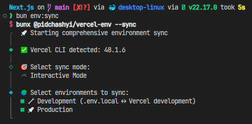

# @pidchashyi/vercel-env

A comprehensive library and CLI tool for syncing environment variables between local files and Vercel. This tool provides both programmatic access through named modules (`deleteEnvs` and `syncEnvs`) and a modern, interactive CLI interface powered by @clack/prompts.



## 📖 What is this?

**@pidchashyi/vercel-env** solves the common problem of keeping environment variables synchronized between your local development environment and your Vercel deployments. Instead of manually copying variables back and forth, this tool provides:

### 🎯 **The Problem It Solves:**
- **Manual sync headaches**: Copying environment variables between local `.env` files and Vercel dashboard
- **Deployment mismatches**: Local and production environments getting out of sync
- **Time-consuming setup**: Setting up new team members or environments
- **Human errors**: Typos, missing variables, or incorrect values during manual copying
- **No version control**: Environment variables aren't tracked or easily managed

### 💡 **The Solution:**
- **Bidirectional sync**: Automatically sync between local files (`.env.local`, `.env.prod`) and Vercel environments
- **Modern interactive interface**: Beautiful CLI powered by @clack/prompts with individual action selection
- **Safety first**: Multiple confirmation prompts, smart exclusion lists, and system variable filtering
- **Developer-friendly**: Both CLI commands and TypeScript library for automation
- **Smart detection**: Automatically detects differences and suggests specific actions
- **Flexible workflows**: Choose individual actions per variable or batch operations

### 🔧 **How It Works:**
1. **Connects** to your Vercel project using the official Vercel CLI
2. **Compares** your local environment files with Vercel's environment variables
3. **Shows differences** in an easy-to-understand format
4. **Lets you choose** what to sync, add, update, or delete
5. **Applies changes** safely with confirmation prompts
6. **Reports results** so you know exactly what happened

### 👥 **Perfect For:**
- **Developers** who work with Vercel deployments
- **Teams** that need consistent environment setups
- **DevOps** automation and CI/CD pipelines
- **Projects** with multiple environments (dev, staging, prod)
- **Anyone** tired of manually managing environment variables

## 🚀 Features

- **Two-way sync** between local `.env` files and Vercel environments
- **Individual action selection** - choose specific actions per variable (add, update, pull, delete)
- **Interactive deletion** with local file cleanup options and safety checks
- **Modern CLI interface** powered by @clack/prompts with beautiful, intuitive prompts
- **Smart system variable filtering** - automatically excludes Vercel system variables
- **Library modules** for programmatic usage with full TypeScript support
- **Environment-specific** operations (development/production)
- **Multiple confirmation levels** with retry options and graceful cancellation
- **Flexible sync modes** - interactive (per-variable) or auto (batch) modes

## 📋 Prerequisites

Before using this library, you need to set up Vercel CLI and authenticate:

### 1. Install Vercel CLI

```bash
npm i -g vercel
```

### 2. Login to Vercel

```bash
vercel login
```

### 3. Link your project

Navigate to your project directory and link it to your Vercel project:

```bash
vercel link
```

This will create a `.vercel` folder in your project with the necessary configuration.

### 4. Verify setup

Test that everything is working:

```bash
vercel env ls development
vercel env ls production
```

## 🛠️ Installation

### As a CLI tool (global):

```bash
npm install -g @pidchashyi/vercel-env
```

**✨ Global installation gives you easier commands:**
After global installation, you can use the shorter `vercel-env` command directly:

```bash
# Easy commands (after global install)
vercel-env --sync           # Instead of npx @pidchashyi/vercel-env --sync
vercel-env --delete         # Instead of npx @pidchashyi/vercel-env --delete
vercel-env --sync --dev     # Instead of npx @pidchashyi/vercel-env --sync --dev
vercel-env --delete --prod  # Instead of npx @pidchashyi/vercel-env --delete --prod
```

### As a library (local):

```bash
npm install @pidchashyi/vercel-env
# or
yarn add @pidchashyi/vercel-env
# or
bun add @pidchashyi/vercel-env
```

> **Note**: The library now uses `@clack/prompts` instead of `inquirer` for a modern, beautiful CLI experience.

## 🏃‍♂️ CLI Usage

### Sync environments

```bash
# If installed globally (easier):
vercel-env --sync                    # Interactive mode - choose everything
vercel-env --sync --dev              # Sync development only (interactive)
vercel-env --sync --prod             # Sync production only (interactive)
vercel-env --sync --dev --auto       # Auto sync development (with confirmation)
vercel-env --sync --auto             # Auto sync both environments

# If installed locally (using npx):
npx @pidchashyi/vercel-env --sync         # Interactive mode - choose everything
npx @pidchashyi/vercel-env --sync --dev   # Sync development only (interactive)
npx @pidchashyi/vercel-env --sync --prod  # Sync production only (interactive)
npx @pidchashyi/vercel-env --sync --dev --auto  # Auto sync development
npx @pidchashyi/vercel-env --sync --auto  # Auto sync both environments
```

### Delete environment variables

```bash
# If installed globally (easier):
vercel-env --delete                  # Interactive deletion (recommended)
vercel-env --delete --dev            # Delete from development
vercel-env --delete --prod           # Delete from production

# If installed locally (using npx):
npx @pidchashyi/vercel-env --delete       # Interactive deletion (recommended)
npx @pidchashyi/vercel-env --delete --dev # Delete from development
npx @pidchashyi/vercel-env --delete --prod # Delete from production
```

> 💡 **New Features**: 
> - **Exit option**: "❌ Exit - Cancel deletion and exit" option for safe cancellation
> - **Local cleanup**: Option to also delete variables from local files (.env.local, .env.prod)
> - **Retry on "No"**: If you decline a deletion, you can go back and choose different actions
> - **System variable filtering**: Automatically excludes Vercel system variables from deletion

## 📚 Library Usage

You can use this library in two ways:

### 1. Import as Library Modules

```typescript
import { syncEnvs, deleteEnvs } from '@pidchashyi/vercel-env';

// Interactive sync (default)
await syncEnvs();

// Auto sync specific environments
await syncEnvs({
  environments: ['development'],
  mode: 'auto'
});

// Delete environment variables
await deleteEnvs({
  environments: ['development']
});
```

### 2. Run Modules Directly with Bun

You can also run the individual module files directly:

```bash
# Run sync module directly
bun node_modules/@pidchashyi/vercel-env/src/actions/sync.ts

# Run delete module directly  
bun node_modules/@pidchashyi/vercel-env/src/actions/delete.ts

# Or if installed globally
bun ~/.bun/install/global/node_modules/@pidchashyi/vercel-env/src/actions/sync.ts
bun ~/.bun/install/global/node_modules/@pidchashyi/vercel-env/src/actions/delete.ts
```

### 3. Local Development (if you have the source)

```bash
# Clone and run directly from source
git clone <repository-url>
cd vercel-env

# Run sync module
bun src/actions/sync.ts

# Run delete module  
bun src/actions/delete.ts

# With command line arguments
bun src/actions/sync.ts --dev --auto
bun src/actions/delete.ts --interactive
```

### 4. Using NPM Scripts (after installation)

The package includes convenient npm scripts:

```bash
# Basic operations
npm run sync          # Interactive sync
npm run delete        # Interactive delete

# Environment-specific operations  
npm run sync:dev      # Auto sync development
npm run sync:prod     # Interactive sync production
npm run delete:dev    # Delete from development
npm run delete:prod   # Delete from production
```

## 🔧 Configuration

The library works with the following local files:

- **Development**: `.env.local` ↔ Vercel development environment
- **Production**: `.env.prod` ↔ Vercel production environment

### Excluded Variables

System variables are automatically excluded from sync and deletion operations to prevent accidental removal of critical Vercel functionality:

**All environments:**
- `VERCEL_OIDC_TOKEN` - System-generated OIDC token
- `VERCEL_URL` - Vercel system variable
- `VERCEL_ENV` - Vercel system variable  
- `VERCEL_REGION` - Vercel system variable

**Production only:**
- `NX_DAEMON` - NX build system variable
- `TURBO_CACHE` - Turborepo cache variable
- `TURBO_DOWNLOAD_LOCAL_ENABLED` - Turborepo download setting
- `TURBO_REMOTE_ONLY` - Turborepo remote-only setting
- `TURBO_RUN_SUMMARY` - Turborepo run summary setting
- `VERCEL` - Vercel system flag
- `VERCEL_TARGET_ENV` - Vercel target environment

> **Note**: These exclusions apply to both sync operations (preventing pull from Vercel) and deletion operations (preventing accidental system variable removal).

## 📦 Project Structure

```
src/
├── actions/
│   ├── delete.ts   # deleteEnvs module with @clack/prompts
│   └── sync.ts     # syncEnvs module with @clack/prompts
├── constants/
│   └── index.ts    # Configuration constants and exclusion lists
├── types/
│   └── index.ts    # TypeScript type definitions
├── cli.ts          # Main CLI interface
└── index.ts        # Library exports
```

## 🔄 How it works

### Sync Process

1. **Fetch** environment variables from both local files and Vercel
2. **Compare** values and identify differences
3. **Present individual choices** for each variable conflict (add, update, pull, remove, or do nothing)
4. **Confirm each action** with descriptive prompts (e.g., "Add 'API_KEY' to Vercel development environment?")
5. **Retry on decline** - if you say "No", you can choose a different action
6. **Apply changes** and report success/failure for each operation

### Delete Process

1. **Fetch** environment variables from selected Vercel environments (excluding system variables)
2. **Display** variables with their values and environments
3. **Allow selection** of variables to delete with "Exit" option at the top
4. **Show selected variables** in confirmation prompt for review
5. **Ask about local cleanup** - option to also delete from .env.local/.env.prod files
6. **Retry on decline** - if you say "No" to deletion, you can go back and select different variables
7. **Execute** deletions from Vercel and optionally local files, then report results

## 🎮 Interactive Features

### Modern CLI Experience

The tool now uses **@clack/prompts** for a beautiful, modern CLI experience:

#### Sync Mode - Individual Action Selection

For each environment variable conflict, you get a dedicated prompt:

```
🔧 Choose action for variable "DATABASE_URL" (development):
│  ● ➕ Add to Vercel - "postgresql://localhost:5432/mydb"
│  ○ 🗑️ Remove from Local - Will delete from .env.local
│  ○ ⏭️ Do nothing with DATABASE_URL
```

Then confirmation with clear context:
```
🔧 ➕ Add "DATABASE_URL" to Vercel development environment?
│  ○ Yes / ● No
```

**If you choose "No"**: You go back to the action selection - no need to start over!

#### Delete Mode - Enhanced Safety

**Variable Selection** with exit option at the top:
```
🗑️ Select environment variables to DELETE:
│  ◯ ❌ Exit - Cancel deletion and exit
│  ◯ 🔧 API_KEY (development)
│  ◯ 🚀 SECRET_TOKEN (production)
│  ◯ 🔧🚀 DATABASE_URL (development, production)
```

**Confirmation** shows exactly what will be deleted:
```
Are you absolutely sure you want to delete these variables?

1. 🔧 API_KEY (development)
2. 🚀 SECRET_TOKEN (production)

🚨 THIS ACTION CANNOT BE UNDONE! 🚨
│  ○ Yes / ● No
```

**Local Cleanup Option**:
```
Also delete these variables from local environment files (.env.local, .env.prod)?
│  ○ Yes / ● No
```

### Key Benefits

- **Individual control**: Choose specific actions per variable
- **Retry-friendly**: Declining an action lets you choose differently
- **Clear context**: Descriptive prompts show exactly what will happen
- **Safe defaults**: Destructive actions default to "No"
- **System protection**: Automatically filters out Vercel system variables
- **Graceful cancellation**: Multiple exit points with friendly messages

## 🤝 Contributing

Contributions, issues, and feature requests are welcome!

## 📄 License

This project is licensed under the [MIT License](LICENSE).

## 👏 Acknowledgments

- [Vercel](https://vercel.com) - For providing excellent deployment platform and CLI tools
- [@clack/prompts](https://github.com/natemoo-re/clack) - For beautiful, modern CLI prompts
- [TypeScript](https://www.typescriptlang.org) - For excellent type safety and developer experience
